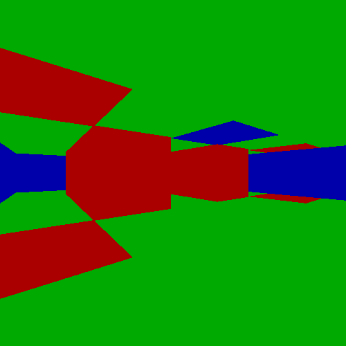

Littlewolf aims to be a very minimalistic software graphics
engine reminiscent of the early wolfenstein and doom days.
The only dependency is SDL2.

Get SDL2 on Debian-based systems (Ubuntu/Kali/etc)
    
    sudo apt-get install libsdl2-dev
    
Get SDL2 on Red Hat-based systems (Fedora/CentOS/etc)

    sudo yum install SDL2-devel

    make; ./littlewolf

Controls:

    move: W,A,S,D

    turn: H,L

    exit: END, ESCAPE
